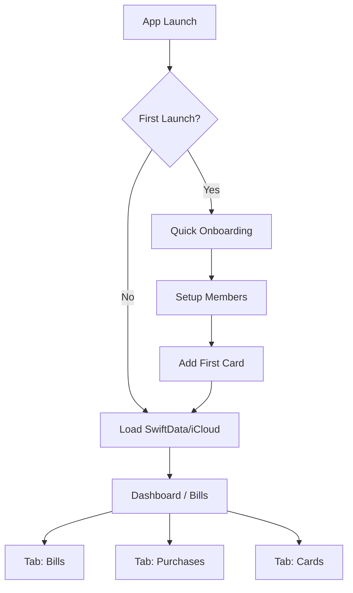
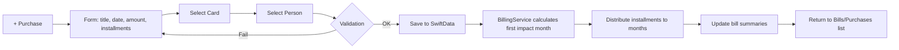

# Argos


> **Argos** — iOS app built with SwiftUI + SwiftData using the MVI architecture.  
> Keep track of shared credit card purchases, split bills between multiple people, and stay on top of your monthly expenses.

---

## 📖 Overview

Argos is designed to solve a common problem for couples or groups sharing the same credit card: **knowing who bought what**.  
The app lets you register purchases, link them to a card and a person, handle installments, and see monthly summaries per person and per card.

---

## ✨ Features

- **Multiple Cards**: Add and manage multiple credit cards.
- **Purchase Tracking**: Record purchases with date, value, installments, and purchaser.
- **Installment Projection**: Automatically calculates how each installment impacts future bills.
- **Bill Summaries**: See totals per card and per person for each month.
- **Filtering**: Filter purchases by person, card, category, or month.
- **iCloud Sync**: Share data between devices (and people) in real time.
- **Modern UI**: Clean, blue-themed interface.

---

## 🛠 Tech Stack

- **Language**: Swift 5+
- **UI Framework**: SwiftUI
- **Persistence**: SwiftData + CloudKit
- **Architecture**: MVI (Model–View–Intent)
- **Minimum iOS**: 17.0

---

## 📂 Project Structure

```
Argos/
├─ App/              # Entry point, dependency injection, app router
├─ Core/             # MVI infra, design system, utils, extensions
├─ Data/             # Models, SwiftData persistence, repositories, services
├─ Features/         # Each feature with its own State, Intent, Reducer, Views
├─ Resources/        # Assets, icons, localization
├─ Tests/            # Unit and UI tests
└─ Config/           # Build settings, schemes
```

---

## 🧭 [WIP] App Flow



---

## 🧾 [WIP] Purchase Registration Flow



---

## 🎯 MVI Cycle

```mermaid
flowchart TD
    U[User Action/UI] --> I[Intent]
    I --> R[Reducer (pure)]
    R -->|Mutable State| S[State]
    R -->|Async Effects| E[Effect (repo/service)]
    E --> I2[New Intent] --> R
    S --> V[View renders from State]
```

---

## 🖼 Screenshots (WIP)

| Dashboard | Bill Detail | New Purchase |
|-----------|-------------|--------------|
|  |  |  |

> Screenshots will be added once UI implementation is in progress.

---

## 🚀 Getting Started

### Requirements
- Xcode 15+
- iOS 17 SDK
- Apple Developer account (for CloudKit sharing)


---

## 📌 Roadmap

- [ ] Core purchase tracking  
- [ ] Installment allocation per bill  
- [ ] Filters by person/card/month  
- [ ] iCloud sharing  
- [ ] Categories & merchants  
- [ ] CSV/OFX import  
- [ ] Widgets  


